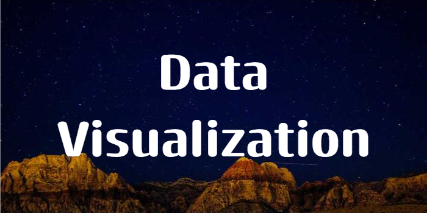
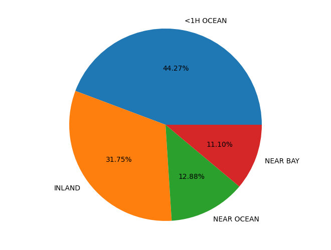

## BANNER-HEADING
***

I am Juud and welcome to my mini Visialization Project

## DATA SOURCE:
***

This project will be making use of kaggle housing dataset attached below. This dataset shows property value for houses in Califonia USA.

[TRANSACTIONS_CSVFILE](https://www.kaggle.com/datasets/camnugent/california-housing-prices)

## OVERVIEW

***

This Project shows a visual represenation using pie chart.
This project displays property ocean proximity on a pie chart

## PIE CHART VISUAL

***

### Tech used

***

